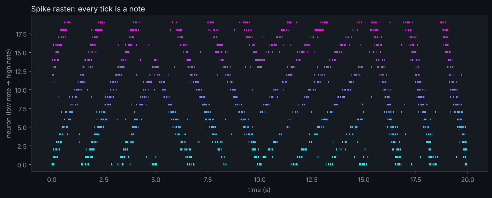

# Spike Symphony

Twenty spiking neurons, each wired to one note of a pentatonic scale. A wave of excitation sweeps across the population, so spikes turn into arpeggios. Download `spike_symphony.wav` from this repo and press play to hear a brain-ish melody.

## Run it

    pip install numpy matplotlib
    python symphony.py

Then open the generated `.wav` file.

## Play with it

- Change `PENTATONIC` to another scale
- Change the `twist` values to make the wave run faster, slower or backwards
- Increase `N` for a bigger orchestra

## Neuroscience notes

Neurons are modelled as Poisson spike generators whose firing rate follows a travelling wave, loosely like waves of activity seen across cortex. Sonification is a real data-exploration tool: your ears are good at spotting rhythm and structure in spike trains.
